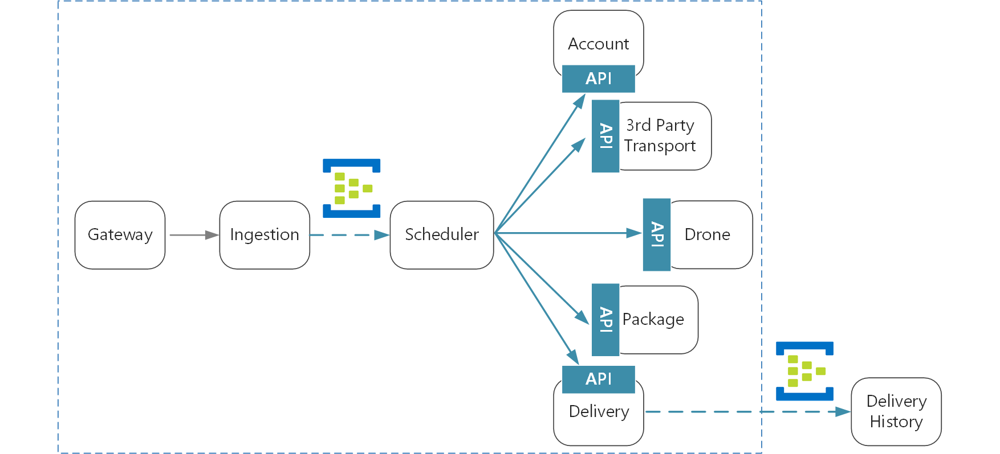

# Interservice communication

When an application is decomposed into microservices, the problem arises of how one service should talk to another. In this section, we look at the tradeoffs between using asynchronous messaging between services versus calling APIs, and discuss some API design considerations. 

## Synchronous API or asynchronous messaging?

There are two main ways that services can communicate with other services:

- **Synchronously** by calling APIs on the service. 
- **Asynchronously** by sending messages or events.   

There are tradeoffs to each approach. Calling an API is a simple, well-understood paradigm. You call a method, and get a response. However, using asynchronous messages has some advantages that can be very useful in a microservices architecture:

- **Reduced coupling**. The message sender does not need to know about the consumer. 
- **Multiple subscribers**. Using a pub/sub model, multiple consumers can subscribe to receive events. See [Event-driven architecture style](/azure/architecture/guide/architecture-styles/event-driven).
- **Failure isolation**. If the consumer goes down, the sender can still continue to send messages. They will be picked up when the consumer recovers. Synchronous calls can create cascading failures. 
- **Asynchronous operations**. The message sender does not have to wait for the consumer to respond. This is especially useful in a microservices architecture. If there is a chain of service dependencies (service A calls B, which calls C, and so on), waiting on synchronous calls can add unacceptable amounts of latency.
- **Load leveling**. A queue can act as a buffer to level the workload. 
- **Workflows**. Queues can be used to manage a workflow, by check-pointing the message after each step in the workflow.

However, there are also some challenges to using asychronous messaging effectively.

- Using a particular messaging infrastructure may cause tight coupling with that infrastructure. It will be difficult to switch to another messaging infrastructure later.
- End-to-end latency may be higher. 
- The messaging infrastructure incurs additional cost. At high throughputs, the cost could become significant.
- Handling asynchronous messaging is not a trivial task. For example, you must handle duplicated messages, either by de-duplicating or by making operations idempotent. 
- Asynchronous messages don't work well for request-response semantics. 
- If the messages require *queue semantics*, the queue can become a bottleneck in the system. Each message requires at least one queue oepration and one dequeue operation. Moreoever, queue semantics generally require some kind of locking inside the messaging infrastructure. If the queue is a managed service, there may be additional latency, because the queue is external to the cluster’s virtual network. You can mitigate these issues by batching messages, but that complicates the code. If the messages don't require queue semantics, you might be able to use an event *stream* instead of a queue. For more information, see [Event-driven architectural style](../guide/architecture-styles/event-driven.md).  

With these considerations in mind, the development team made the following design choices.

- The Delivery Scheduler service exposes a public API. Client applications use this API to schedule, update, or cancel deliveries.
- The backend services (Accounts, Delivery, Package, and Drone Management) expose internal APIs. The Delivery Scheduler service calls these to create or update a delivery request. One reason to use APIs here is that the Delivery Scheduler service requires a response from the downstream services. A failure in any of the downstream services means the entire operation failed. A potential issue is the amount of latency that is introduced by calling the backend services. Later, we'll discuss the workflow in more detail. 
- The Delivery service also exposes some public APIs that are used by clients to get the status of a delivery and to request delivery notification via text or email. Later, we'll see that a gateway can be used to isolate clients from needing to know which service exposes a particular API. 
- While a drone is in flight, the Drone Management service sends events about the drone's current location and status. 
- The Delivery service sends events that describe the status of a delivery, including Created, Rescheduled, InTransit, and DeliveryComplete. Events make it possible for any interested service to subscribe to status updates. In the current design, the Delivery Service is the only subscriber, but it's possible that other services might need to consume these events. For example, they might be used for a dashboard or real-time analytics service. Another reason to use events is that it removes the consumers from the workflow path, meaning the Delivery Scheduler does not have to wait on them.
- The Delivery History service subscribes to the delivery events and stores the history of every delivery. 

Notice that delivery events are derived from drone events. For example, when a drone reaches a delivery location and drops off a package, the Delivery service translates this into a DeliveryCompleted event. This is an example of thinking in terms of domain models. As described earlier, Drone Management belongs in a separate bounded context. The drone events convey the physical location of a drone. The delivery events, on the other hand, represent changes in the status of a delivery, which is a different business entity.