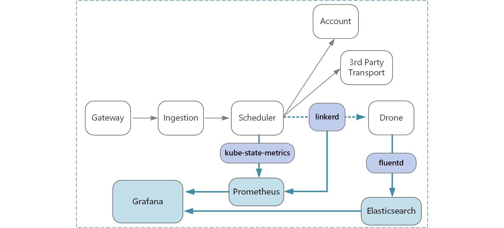

# Logging and monitoring in a microservices application

In any complex application, at some point something will go wrong. The application may experience failures, or become overwhelmed with requests. Logging and monitoring should provide a holistic view of how the system behaves. 

In a microservices architecture, it can be especially challenging to pinpoint the exact cause of errors or performance bottlenecks. A single user operation might span multiple services. Services may hit network I/O limits inside the cluster. A chain of calls across services may cause backpressure in the system, resulting in high latency or cascading failures. Moreover, you generally don't know which node a particular container will run in. Containers placed on the same node may be competing for limited CPU or memory. 

You can categorize these into metrics and text-based logs. 

*Metrics* are numerical values that can be analyzed. You can use them to observe the system in real time (or close to real time), or to analyze performance trends over time. 

- System metrics, such as CPU, memory, garbage collection, thread count, and so on. Because services run in containers, you need to collect metrics at the container level, not just at the VM level. Fortunately, Kubernetes provides several options for collecting cluster metrics, including Heapster and [kube-state-metrics][kube-state-metrics].
   
- Application metrics. This includes any metrics that relevant to understanding the behavior of a service. Examples include the number of outgoing HTTP requests, request latency, message queue length, or number of transactions processed per second.

- Dependent service metrics. Services inside the cluster may call external services that are outside the cluster, such as managed PaaS services. You can monitor Azure services by using [Azure Monitor](/azure/monitoring-and-diagnostics/monitoring-overview). Third-party services may or may not provide any metrics. If not, you'll have to rely on your own application metrics to track statistics for latency and error rate.

*Logs* are records of events that occur while the application is running. They include things like application logs (trace statements) or web server logs. Logs are primarily useful for forensics and root cause analysis. 

## Considerations

Here are some factors to consider when you choose a logging and monitoring solution.

**Configuration and management.** Managed service vs deployed in the cluster
    - You can do monitoring inside the cluster and also push to OMS 

**Ingestion rate**. What is the throughput at which the system can ingest telemetry events? What happens if that rate is exceeded? For example, the system may throttle clients, in which case telemetry data is lost, or it may downsample the data. 

**Data fidelity**. How accurate are the metrics? Averages can hide outliers, especially at scale. Also, if the sampling rate is too low, it can smooth out fluctuations in the data. It may appear that 

**Latency**. To enable real-time monitoring and alerts, telemetry data should be available quick. How "real-time" is the data that appears on the monitoring dashboard? A few seconds old? More than a minute?

**Storage.** For logs, it may be most efficient to write the log events to ephemeral storage in the cluster, and configure an agent to ship the log files to more persistent storage.  Data should eventually be moved to long-term storage so that it's available for retrospective analysis. A microservices architecture can generate a large volume of telemetry data, so the cost of storing that data is an important consideration. Also consider how you will query the data. 

**Dashboard and visualization.** Do you get a holistic view of the system, across all of the services, both within the cluster and external services? If you are writing telemetry data and logs to more than one location, can the dashboard show all of them and correlate?

<!--
    - Approaches to reduce the load on the telemetry system:
        - Aggregation of metrics (statistical data)
        - Sampling - process only a percentage of the events
        - Batching - to reduce the number of calls to the telemetry service

    - What is the granularity of the data. 

    - Avoid any blocking calls to write logs or telemetry data. 

Structured logging. It's good for logs to be structured (JSON) rather than raw text - however you may not control all of the logging, other components in the system (Nginx, IIS, whatever) may be creating unstructured logs. One challengs is how to aggregate them.

Separate monitoring components from services as much as possible

Use a logging abstraction that you can plug in a pipeline by configuration. 

Handle batching and aggregation in the pipeline, not directly in the app code. Pipeline can also enrich the events with extra information (e.g. correlation ID)
-->

## Correlation IDs and distributed tracing

As mentioned, one challenge in microservices is understanding the flow of events across services. A single operation or transaction may involve calls to multiple services. In order reconstruct the entire sequence of steps, each service should propagate a *correlation ID* that acts as a unique identitifer for that operation. The correlation ID enables [distributed tracing](http://microservices.io/patterns/observability/distributed-tracing.html) across services.

The first service that receives a client request should generates the correlation ID. If the service makes an HTTP call to another service, it puts the correlation ID in a request header. Similarly, if the service sends an asynchronous message, it puts the correlation ID into the message. Downstream services continue to propagate the correlation ID, so that it flows through the entire system. In addition, all code that writes application metrics or log events should include the correlation ID.

If errors or exceptions occur, the correlation ID lets you find the upstream or downstream calls that were part of the same operation. Correlation IDs also makes it possible to calculate metrics like end-to-end latency for a complete transaction, number of successful transactions per second, and percentage of failed transactions.

Some considerations when implementing correlation IDs:

- There is currently no standard HTTP header for correlation IDs. Your team should standardize on a custom header value. The choice may be decided by your logging/monitoring framework or the service mesh.

- For asynchronous messages, if your messaging infrastructure supports adding metadata to messages, you should include the correlation ID as metadata. Otherwise, include it as part of the message schema.

- Rather than a single opaque identitier, you might send a *correlation context* that includes richer information, such the caller-callee relationships. 

- The Azure Application Insights SDK will automatically inject correlation IDs into HTTP headers, and includes the correlation ID in Application Insights logs. If you decide to use the correlation features built into Application Insights, some services may still need to explicity propagate the correlation ID. For more information, see [Telemetry correlation in Application Insights](/azure/application-insights/application-insights-correlation).
   
- If you are using Istio or linkerd as a service mesh, these technologies automatically generate correlation headers when HTTP calls are routed through the service mesh proxies. Services should forward the relevant headers. 

    - Istio: [Distributed Request Tracing](https://istio-releases.github.io/v0.1/docs/tasks/zipkin-tracing.html)
    
    - linkerd: [Context Headers](https://linkerd.io/config/1.3.0/linkerd/index.html#http-headers)
    
- Consider how you will aggregate logs. You may want to standardize on a schema for including correlation IDs in logs across all services.

## Technology options

**Kubernetes** collects cluster metrics. You can use a service like Heapster or [kube-state-metrics][kube-state-metrics] to aggregate these metrics and send them to a sink.

**Application Insights** is a managed service in Azure that ingests and stores telemetry data, and provides tools for analyzing and searching the data. To use Application Insights, you install an instrumentation package in your application. This packages monitors the app and sends telemetry data to the Application Insights service. It can also pull telemetry data from the host environment. Application Insights provides built-in correlation and dependency tracking. It lets you track system metrics, application metrics, and Azure service metrics, all in one place.

Be aware that Application Insights throttles if the data rate exceeds 32K events per second. A single operation may generate several telemetry events, so if your application expects a high volume traffic, it is likely to get throttled. To mitigate this problem, you can perform sampling to reduce the telemetry traffic. The tradeoff is that your metrics will be less precise. For more information, see [Sampling in Application Insights](/azure/application-insights/app-insights-sampling). You can also reduce the data volume by pre-aggregating metrics &mdash; that is, calculating statistical values such as average and standard deviation, and sending those values instead of the raw telemetry. The following blog post describes an approach to using Application Insights at scale: [Azure Monitoring and Analytics at Scale](https://blogs.msdn.microsoft.com/azurecat/2017/05/11/azure-monitoring-and-analytics-at-scale/).

In addition, make sure that you understand the pricing model for Application Insights, because you are charged based on data volume. If your application generates a large volume of telemetry, and you don't wish to perform sampling or aggregation of the data, then Application Insights may not be the appropriate choice. For more information, see [Manage pricing and data volume in Application Insights](/azure/application-insights/app-insights-pricing).

For system and container metrics, consider using a time-series database such as **Prometheus** or **InfluxDB** running in the cluster. In this configuration, Prometheus or InfluxDB runs as a pod in the cluster. The pod scrapes either Heapster or kube-state-metrics for metrics. Use a dashboard tool such as **Kibana** or **Grafana** to visualize and monitor the data. These can also run as containers in the cluster.

For application logs, consider using **Fluentd** and **Elasticsearch**. Fluentd is an open source data collector, and Elasticsearch is a document database that is highly optimized to act as a search engine. In this approach, each service sends logs to `stdout` and `stderr`, and Kubernetes writes these streams to the local file system. Fluentd collects the logs, optionally enriches them with additional metadata from Kubernetes, and sends the logs to Elasticsearch. Use Kibana, Grafana, or a similar tool to create a dashboard for Elasticsearch. Fluentd runs as a daemonset in the cluster, which ensures that one Fluentd pod is assigned to each node. You can configure Fluentd to collect kubelet logs as well as container logs. 

One advantage of using Fluentd with Elasticsearch for logs is that services do not require any additional library dependencies. Each service just writes to `stdout` and `stderr`, and Fluentd handles exporting the logs into Elasticsearch. (It's still a good practice to use some kind of logging library or abstraction, to keep your code clean and modularized.) Also, the teams writing services don't need to understand how to configure the logging infrastructure. One challenge is to configure the Elasticsearch cluster for a production deployment, so that is scales to handle your traffic. You will also need to implement log rotation.

<!-- links -->

[kube-state-metrics]: https://github.com/kubernetes/kube-state-metrics
